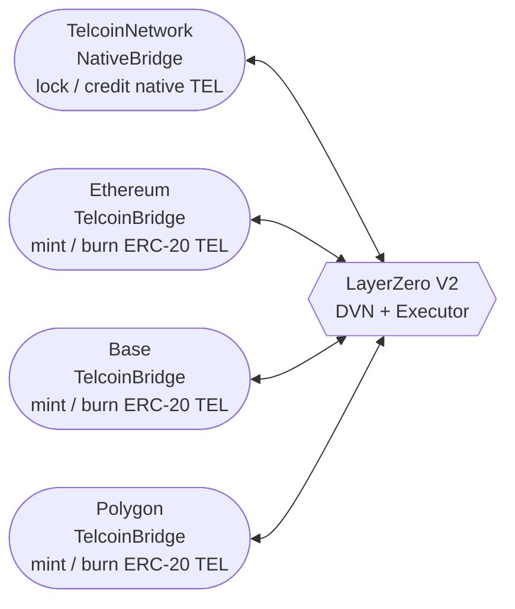

# OldToken to Telcoin V3 Migration

## Overview

This project implements a migration system from OldToken (2 decimals) to Telcoin V3 (18 decimals) tokens at a 1:1 exchange rate using CREATE3 for deterministic deployment.

## Cross-Chain Architecture

### OFT Mesh Topology

TEL is bridged through a LayerZero V2 OFT mesh. Every satellite chain (Ethereum, Base, Polygon, etc.) runs a `TelcoinBridge`; TelcoinNetwork runs a single `NativeBridge`. All bridges communicate through the LayerZero protocol — no direct chain-to-chain connections exist outside of it.




## Contract Features

### New Token (TelcoinV3)

- ERC-20 compliant token with 18 decimals
- Hard supply cap: 100 billion tokens (`MIGRATION_SUPPLY_CAP`) — enforced in constructor and `mint()`
- Minted on demand by the migration contract (no pre-funding required)
- Role-based access: `MINTER_ROLE`, `BURNER_ROLE`, `PAUSER_ROLE`, `UNPAUSER_ROLE`
- Pause only blocks transfers between non-zero addresses; mints and burns remain active
- **`burn()` requires prior approval**: the token holder must `approve` the caller (e.g. `MintBurnWrapper`) before their tokens can be burned — protects against a compromised BURNER_ROLE draining arbitrary wallets
- **`rescueBurn(from, amount)`**: gated by `DEFAULT_ADMIN_ROLE`; burns from any wallet without approval — reserved for governance emergency response (e.g. burning hacker balances)
- **`renounceRole()` disabled**: no role holder, including `DEFAULT_ADMIN_ROLE`, can voluntarily renounce their role — roles may only be revoked by an admin
- **EIP-2612 (permit)**: gasless approvals via signed EIP-712 messages — users can authorize a spender without an on-chain `approve()` transaction
- **EIP-3009 (transferWithAuthorization)**: gasless transfers via signed EIP-712 messages — `transferWithAuthorization` (anyone can submit), `receiveWithAuthorization` (only payee can submit, prevents front-running), and `cancelAuthorization` (revoke unused nonces)
- **EIP-1271 smart contract wallet support**: all signature-verified functions provide both `(v, r, s)` overloads (EIP-2612/3009 standard) and `bytes signature` overloads for full EIP-1271 compatibility. The `(v, r, s)` versions delegate to the `bytes` versions internally. The `bytes` overloads accept arbitrary-length signature blobs (e.g. Gnosis Safe multi-sig concatenated signatures, ERC-4337 account signatures) and forward them to `SignatureChecker`, which routes to `ECDSA.recover` for EOAs or `IERC1271.isValidSignature` for contract wallets
- **Independent nonce systems**: EIP-2612 uses sequential `uint256` nonces (via OZ `Nonces`); EIP-3009 uses random `bytes32` nonces tracked in a separate mapping — no interference between the two

### Migration Contract

- **1:1 exchange rate** with automatic decimal conversion (2 → 18)
- **Mint-based**: mints TelcoinV3 directly; does not hold a pre-funded token reserve
- **Whole-balance migration**: `migrate()` exchanges the caller's entire OldToken balance in one call
- **Escrow model**: OldToken is held in the migration contract (not burned) so that legacy liquidity pool positions can be unwound after migration concludes
- **Delayed withdrawal**: owner can withdraw all escrowed legacy tokens via `withdrawOldTokens()` only after `migrationExpiry + withdrawalDelay`
- **Pausable** by owner for emergency situations
- **Time-bounded**: migrations revert at or after `migrationExpiry`
- **Ownable2Step**: ownership transfers require acceptance by the new owner
- **Owner functions:**
  - Pause/unpause migrations
  - Extend migration expiry via `setMigrationExpiry()`
  - Withdraw escrowed legacy tokens via `withdrawOldTokens(destination)` (after withdrawal delay)
  - Recover accidentally sent tokens (excluding legacy token) via `recoverERC20(destination, tokenAddress, amount)`

### TelcoinBridge (Satellite Chains)

- LayerZero V2 `MintBurnOFTAdapter` deployed on each satellite chain (Ethereum, Polygon, Base, etc.)
- Mint/burn operations are **delegated to `MintBurnWrapper`** — the bridge itself holds no token roles
- On send: wrapper burns ERC20 TEL from the sender; on receive: wrapper mints ERC20 TEL to the recipient
- Compatible with `NativeBridge` on TelcoinNetwork — both encode messages via `OFTMsgCodec`
- `sharedDecimals = 6`, `decimalConversionRate = 1e12`; sub-1e12 wei dust is stripped before send
- **Ownable2Step**: ownership transfers require acceptance; `renounceOwnership()` is permanently disabled
- **Owner functions:**
  - Pause/unpause bridge
  - Rescue accidentally sent tokens via `rescueTokens(token, amount)`
  - Configure LayerZero delegate via `setDelegate()`

### NativeBridge (TelcoinNetwork)

- LayerZero V2 `NativeOFTAdapter` deployed on TelcoinNetwork where TEL is the **native gas token**
- On send: locks native TEL in the contract (reserve increases); on receive: credits native TEL to recipient
- Requires `msg.value == fee + bridgeAmount` on every send call
- Funded at deployment with a native TEL reserve to cover inbound credits; owner tops up via direct ETH transfer to `receive()`
- Accepts direct ETH via `receive()` for reserve top-ups; emits `ReserveFunded(funder, amount)`
- `sharedDecimals = 6`, matching all satellite `TelcoinBridge` deployments
- Only **one NativeBridge** should exist across the entire OFT mesh
- **Ownable2Step**: ownership transfers require acceptance; `renounceOwnership()` is permanently disabled
- **Owner functions:**
  - Pause/unpause bridge
  - Rescue accidentally sent ERC20 tokens via `rescueTokens(token, amount)`
  - Configure LayerZero delegate via `setDelegate()`

### MintBurnWrapper

- Adapter contract that satisfies the `IMintableBurnable` interface required by `MintBurnOFTAdapter`
- Holds `MINTER_ROLE` and `BURNER_ROLE` on TelcoinV3; `TelcoinBridge` holds neither role directly
- **Decouples bridge upgrades from token role management**: swap bridges by calling `revokeBridge` / `authorizeBridge` — no TelcoinV3 role changes needed
- Tracks a **single authorized bridge** via `address public bridge`; only that address may call `mint` or `burn`
- **Idempotency guards**: `authorizeBridge` reverts if the address is already set (`BridgeAlreadySet`); `revokeBridge` reverts if nothing is set (`BridgeNotSet`) or the wrong address is supplied (`UnauthorizedBridge`)
- Emits `BridgeMinted(bridge, to, amount)` and `BridgeBurned(bridge, from, amount)` on every mint/burn for on-chain observability
- **Ownable2Step**: `renounceOwnership()` is permanently disabled
- **Owner functions:**
  - Authorize the bridge via `authorizeBridge(bridge)`
  - Revoke the bridge via `revokeBridge(bridge)` (must supply the currently-set address to confirm intent)

## Deployment Instructions

### Prerequisites

1. Install Foundry: https://book.getfoundry.sh/getting-started/installation
2. Set up environment variables:

```bash
export PRIVATE_KEY="private-key"
export RPC_URL="ethereum-rpc-url"
export ETHERSCAN_API_KEY="etherscan-api-key" # For verification
```

### Step 1: Update OldToken Address

Edit the deployment script and replace the placeholder with OldToken token address:

```solidity
address constant OLDTOKEN_ADDRESS = 0x... // old token address
```

### Step 2: Deploy Contracts

Run the deployment script:

```bash
# Deploy with random salts
forge script script/DeployScript.s.sol:DeployScript --rpc-url $RPC_URL --broadcast --verify

# Or deploy with custom salts for more control
forge script script/DeployScript.s.sol:DeployWithCustomSalt --rpc-url $RPC_URL --broadcast --verify --sig "run(string,string)" "my-telcoin-v3-salt" "my-migration-salt"
```

### Step 3: Verify Deployment

After deployment, verify:

1. TelcoinV3 total supply matches chain allocation (up to 100B tokens, 10^29 base units)
2. Migration contract has `MINTER_ROLE` on TelcoinV3
3. Migration contract has correct OldToken and TelcoinV3 addresses
4. `migrationExpiry` is set to the intended deadline
5. `MintBurnWrapper` holds `MINTER_ROLE` and `BURNER_ROLE` on TelcoinV3
6. `TelcoinBridge` is authorized on `MintBurnWrapper` (`wrapper.bridge() == bridgeAddress`)
7. `NativeBridge` is funded with sufficient native TEL reserve
8. `TelcoinBridge` and `NativeBridge` peers are set correctly on both sides (`setPeer`)

### Step 4: Test Migration (Optional)

Test with a small amount first:

```bash
# Run tests
forge test -vvv

# Test on testnet first
forge script script/DeployScript.s.sol:DeployScript --rpc-url $TESTNET_RPC_URL --broadcast
```

## Usage Guide

### For Users

1. **Approve** the migration contract to spend your entire OldToken balance
2. **Call `migrate()`** — no arguments required; migrates your entire OldToken balance
3. **Receive** TelcoinV3 tokens automatically (OldToken balance × 10^16)

Example using Etherscan:

1. Go to OldToken token contract
2. Call `approve(migrationAddress, yourFullBalance)`
3. Go to Migration contract
4. Call `migrate()`

### For Owner/Admin

#### Pause Migrations

```solidity
migration.pause() // Stop all migrations
migration.unpause() // Resume migrations
```

#### Extend Migration Window

```solidity
migration.setMigrationExpiry(newTimestamp) // Must be greater than current expiry
```

#### Recover Accidentally Sent Tokens

```solidity
migration.recoverERC20(destination, tokenAddress, amount)
```

## Key Calculations

- **OldToken (2 decimals):** 100B = 10,000,000,000.00 = 10^13 base units
- **Telcoin V3 (18 decimals):** 100B = 100,000,000,000.000000000000000000 = 10^29 base units
- **Conversion multiplier:** 10^16 (to convert from 2 to 18 decimals)

### Example Migration

- User has: 1,000 OldToken (2 decimals) = 100,000 base units
- User receives: 1,000 Telcoin V3 (18 decimals) = 1,000,000,000,000,000,000,000 base units

## Security Considerations

1. **Reentrancy Protection**: Migration and recovery functions use OpenZeppelin's ReentrancyGuard
2. **Pausable**: Owner can pause migrations or bridging in case of emergency; both `send` and `_lzReceive` are gated on all bridge contracts
3. **Immutable Token Addresses**: Token addresses cannot be changed after deployment
4. **Two-Step Ownership**: All contracts use `Ownable2Step`; ownership transfers require explicit acceptance. `renounceOwnership()` is permanently disabled on `TelcoinBridge`, `NativeBridge`, and `MintBurnWrapper`
5. **Role Non-Renouncement**: `TelcoinV3` overrides `renounceRole()` to always revert — roles can only be revoked by an admin, never voluntarily surrendered
6. **Access Control**: Critical functions restricted to owner or role holders
7. **Safe Math**: Solidity 0.8+ automatic overflow protection
8. **Burn Approval Requirement**: `TelcoinV3.burn()` requires the token holder to have approved the caller. A compromised `BURNER_ROLE` (e.g. `MintBurnWrapper`) cannot drain wallets that have not explicitly approved it
9. **Emergency rescueBurn**: `TelcoinV3.rescueBurn()` allows `DEFAULT_ADMIN_ROLE` to burn from any wallet without approval — scoped exclusively to governance for hack response; not accessible to `BURNER_ROLE`
10. **Bridge Role Decoupling**: `TelcoinBridge` holds no direct roles on `TelcoinV3`. Mint/burn capability is managed through `MintBurnWrapper`, so bridges can be upgraded or revoked without modifying TelcoinV3's access control
11. **Single Active Bridge**: `MintBurnWrapper` tracks one bridge address at a time. Replacing a bridge requires `revokeBridge` + `authorizeBridge` on the wrapper and `setPeer` updates — no token governance action required
12. **Single NativeBridge Constraint**: Only one `NativeBridge` should exist across the OFT mesh; deploying multiple would break lock/credit accounting
13. **EIP-712 Domain Separation**: EIP-2612 and EIP-3009 share a single EIP-712 domain separator (via `ERC20Permit` / `EIP712`), but use distinct type hashes — a permit signature cannot be replayed as a `transferWithAuthorization` or vice versa. Cross-chain replay is prevented by `chainId` in the domain separator
14. **EIP-3009 Replay Protection**: Each authorization nonce is a random `bytes32` that transitions `false → true` (one-shot latch) and can never revert to `false`. `cancelAuthorization` marks a nonce as used without executing a transfer
15. **EIP-1271 Signature Verification**: `SignatureChecker.isValidSignatureNow()` issues a `staticcall` to the signer contract for EIP-1271 validation — no state modification is possible during the callback
16. **Dual Signature Overloads**: Each signature-verified function (`permit`, `transferWithAuthorization`, `receiveWithAuthorization`, `cancelAuthorization`) has both a standard `(v, r, s)` overload (for EIP spec compliance and EOA convenience) and a `bytes signature` overload (for multi-sig wallets and arbitrary EIP-1271 blobs). The `(v, r, s)` versions pack and delegate to the `bytes` versions

## Gas Estimates

- Migration transaction: ~100,000 gas
- Deployment: ~2,000,000 gas (both contracts)

## Addresses (After Deployment)

Update these after deployment:

```
OldToken Token: 0x... (existing)
Telcoin V3 Token: 0x... (new)
Migration Contract: 0x...
```

## Testing

Run the full test suite:

```bash
# Run all tests
forge test

# Run specific test
forge test --match-test testMigration -vvv

# Gas report
forge test --gas-report
```

## CREATE3 Benefits

Using CREATE3 provides:

- **Deterministic addresses** before deployment
- **Cross-chain same addresses** if using same salt
- **Deployment order independence** between Telcoin V3 and migration contracts

## Support

For issues or questions:

1. Check contract events for migration history
2. Use read functions to check balances and rates
3. Ensure sufficient gas for transactions (recommend 150,000 gas limit)

## License

MIT

## Foundry

**Foundry is a blazing fast, portable and modular toolkit for Ethereum application development written in Rust.**

Foundry consists of:

- **Forge**: Ethereum testing framework (like Truffle, Hardhat and DappTools).
- **Cast**: Swiss army knife for interacting with EVM smart contracts, sending transactions and getting chain data.
- **Anvil**: Local Ethereum node, akin to Ganache, Hardhat Network.
- **Chisel**: Fast, utilitarian, and verbose solidity REPL.

## Documentation

https://book.getfoundry.sh/

## Usage

### Build

```shell
$ forge build
```

### Test

```shell
$ forge test
```

### Format

```shell
$ forge fmt
```

### Gas Snapshots

```shell
$ forge snapshot
```

### Anvil

```shell
$ anvil
```

### Deploy

```shell
$ forge script script/DeployScript.s.sol:DeployScript --rpc-url <RPC_URL> --broadcast --verify
```

### Cast

```shell
$ cast <subcommand>
```

### Help

```shell
$ forge --help
$ anvil --help
$ cast --help
```
